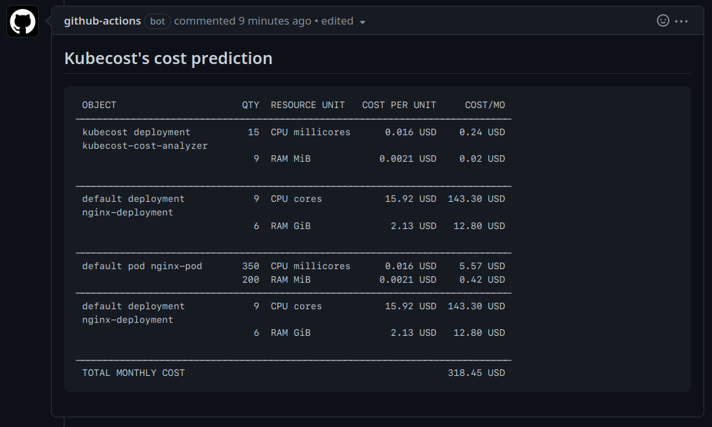

# Kubernetes Cost Prediction Action

Predict the cost of Kubernetes resource specs (manifests) in CI! Make cost decisions before
merging changes.

This is a GitHub Action, powered by [Kubecost](https://docs.kubecost.com/install-and-configure/install), to make cost predictions for K8s
workloads before they are applied to your cluster. It _does not_ require you to
have Kubecost installed, but will have highly-accurate cost and usage
information for your environment if you do.

In action:



## Usage

Add this Action as a step in one of your Actions workflows and point it at some
YAML files.

### Simple

Below is an excerpt from a workflow written with this Action. This is the
easiest way to add Kubernetes cost prediction to your CI.

``` yaml
- name: Run prediction
  id: prediction
  uses: kubecost/cost-prediction-action@v0
  with:
    # Set this to the path containing your YAML specs. It can be a single
    # YAML file or a directory. The Action will recursively search if this
    # is a directory and process all .yaml/.yml files it finds.
    path: ./repo

# Write/update a comment with the prediction results.
- name: Update PR with prediction results
  uses: edumserrano/find-create-or-update-comment@v1
  with:
    issue-number: ${{ github.event.pull_request.number }}
    body-includes: '<!-- kubecost-prediction-results -->'
    comment-author: 'github-actions[bot]'
    edit-mode: replace
    body: |
      <!-- kubecost-prediction-results -->
      
      ## Kubecost's total cost prediction for K8s YAML Manifests in this PR

      \```
      ${{ steps.prediction.outputs.PREDICTION_TABLE }}
      \```
```

### Advanced (full workflow)

This is a full Actions workflow file, with commented-out sections and
explanations highlighting advanced features and some complex use-cases.

``` yaml
name: Predict K8s spec cost
on: [pull_request]

jobs:
  predict-cost:
    runs-on: ubuntu-latest
    steps:
      # Check out the current repo to ./repo
      - uses: actions/checkout@v2
        with:
          path: ./repo
          
      # If using the API support, you need to make sure the Action runner has
      # network access to your instance of Kubecost. This is infra dependent;
      # the following example works with GKE (make sure to set up the necessary
      # secrets).
      # https://docs.github.com/en/actions/guides/deploying-to-google-kubernetes-engine
      # - name: Setup gcloud
      #   uses: google-github-actions/setup-gcloud@v0.2.0
      #   with:
      #     service_account_key: ${{ secrets.GCP_SA_KEY_B64 }}
      #     project_id: ${{ secrets.GKE_PROJECT_ID }}
      # 
      # Get GKE credentials so kubectl has access to the cluster
      # - name: Get GKE credentials
      #   uses: google-github-actions/get-gke-credentials@v0.2.1
      #   with:
      #     cluster_name: ${{ secrets.GKE_CLUSTER }}
      #     location: ${{ secrets.GKE_ZONE }}
      #     credentials: ${{ secrets.GCP_SA_KEY_B64 }}
      #     project_id: ${{ secrets.GKE_PROJECT_ID }}
      # 
      # - name: Forward the kubecost service
      #   run: |
      #     kubectl port-forward --namespace kubecost service/kubecost-cost-analyzer 9090 &
      #     sleep 5
      
      # If you use Helm, you should template the chart and then run the Predict
      # Action targeting the result. Here's an example of how to do that.
      # 
      # - name: Install helm
      #   run: |
      #     curl https://raw.githubusercontent.com/helm/helm/master/scripts/get-helm-3 | bash
      # 
      # - name: Helm template
      #   run: |
      #     helm template RELEASENAME ./repo >> ./templated.yaml

      - name: Run prediction
        id: prediction
        uses: kubecost/cost-prediction-action@v0
        with:
          log_level: "info"
          # Set this to the path containing your YAML specs. It can be a single
          # YAML file or a directory. The Action will recursively search if this
          # is a directory and process all .yaml/.yml files it finds.
          # 
          # If you use Helm, you probably want to run "helm template", output
          # to a path like ./templated.yaml, and set "path: ./templated.yaml".
          path: ./repo
          # Set this to either:
          # - localhost:9090/model if port forwarding OR
          # - The URL of your Kubecost instance if the runner has direct network
          #   access, e.g. "https://kubecost.example.com:9090/model"
          #
          # If unset, the Action will use Kubecost's default pricing to make a
          # prediction and it will be unable to make
          #
          # kubecost_api_path: "http://localhost:9090/model"

      # Write/update a comment with the prediction results.
      - name: Update PR with prediction results
        uses: edumserrano/find-create-or-update-comment@v1
        with:
          issue-number: ${{ github.event.pull_request.number }}
          body-includes: '<!-- kubecost-prediction-results -->'
          comment-author: 'github-actions[bot]'
          edit-mode: replace
          body: |
            <!-- kubecost-prediction-results -->
            
            ## Kubecost's total cost prediction for K8s YAML Manifests in this PR

            \```
            ${{ steps.prediction.outputs.PREDICTION_TABLE }}
            \```

      # Alternatively, you can just output the prediction in the Action log.
      # - name: output raw yaml prediction
      #   run: |
      #     echo "${{ steps.prediction.outputs.PREDICTION_TABLE }}"
```

### Inputs/Outputs

#### Action inputs

| Name | Description | Required? | Default |
|------|-------------|-----------|---------|
| `path` | The path of a file or directory that contains K8s YAML manifests to predict the cost impact of | Yes | |
| `kubecost_api_path` | URL of your Kubecost API. If provided, cost predictions will be a diff based on cost data tracked by your Kubecost instance. If not provied, cost predictions will be a total cost based on Kubecost's default pricing. | No | |
| `log_level` | The log level to run the Action with. Set to `debug` for more granularity or `warn` or `error` for less granularity. | No | `info` |

#### Action outputs

| Name | Description |
|------|-------------|
| `PREDICITION_TABLE` | An ASCII-formatted table of the cost prediction. Best rendered in monospace. |

## Limitations

The Action currently only supports predicting `.yml`/`.yaml` specs. If you have
specs in other formats, you will have to put them into YAML before running
prediction logic. E.g. for Helm, use `helm template`. More support planned,
please open an issue describing your use case if it is not yet supported.

The Action supports a limited set of Kubernetes object types. We are working
to expand the set of supported types.

The Action does not yet support prediction on only changed files.

The Action does not provide predictions for objects/specs without container
resource requests.

## Development

Source code for the container is mostly closed. Kubecost engineers, visit
`cmd/costpredictionaction` in KCM for more information about development, testing, and releasing.
