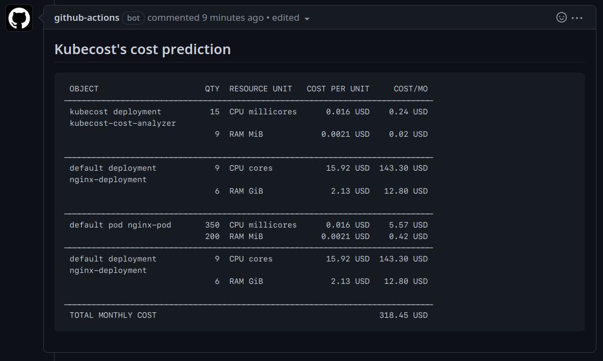

# Kubernetes Cost Prediction Action

Predict the cost of Kubernetes manifests (specs) in CI! Make cost decisions before
merging changes.

This is a [GitHub Action](https://docs.github.com/en/actions), powered by [Kubecost](https://www.ibm.com/docs/en/kubecost/self-hosted/3.x), to make cost predictions for K8s
workloads before they are applied to your cluster. It _does not_ require you to
have Kubecost installed, but will have highly-accurate cost and usage
information for your environment if you do.

In action:



## Usage

Add this Action as a step in one of your Actions workflows and point it at a single
YAML file or a directory containing at least one YAML file. Non-YAML files will be
ignored. The YAML files will be interpreted as Kubernetes manifests and a cost
prediction will be run on supported types of [Kubernetes objects](https://kubernetes.io/docs/concepts/overview/working-with-objects/kubernetes-objects/).

> [!NOTE]
> Until the next release, point `path` at a file or directory that contains
> only Kubernetes workload manifests. v0.1.1 stops with an error at any YAML
> under `path` that is not a built-in Kubernetes object, such as workflow
> files, Helm values, `kustomization.yaml` or custom resources. That is why
> the examples use `./repo/k8s` rather than the whole checkout.

> If you aren't familiar with GitHub Actions, check out GitHub's [quickstart](https://docs.github.com/en/actions/quickstart)
> documentation.

### Simple

Below is an excerpt from a workflow written with this Action. This is the
easiest way to add Kubernetes cost prediction to your CI. If you want
a premade workflow file to riff on, check out the "Advanced" example
below.

~~~yaml
# The job that runs these steps needs:
#   permissions:
#     contents: read
#     pull-requests: write
- name: Check out the repo to ./repo
  uses: actions/checkout@3d3c42e5aac5ba805825da76410c181273ba90b1 # v7.0.1
  with:
    path: ./repo
    persist-credentials: false

- name: Run prediction
  id: prediction
  uses: kubecost/cost-prediction-action@c3da04e43aba423c447b6b4fb225fb16c9d63305 # v0.1.1
  with:
    # Set this to the path containing your YAML specs. It can be a single
    # YAML file or a directory. The Action will recursively search if this
    # is a directory and process all .yaml/.yml files it finds.
    path: ./repo/k8s

# Show the prediction in the job summary. This also works for pull requests
# from forks, where the comment step below is skipped.
- name: Add prediction to job summary
  env:
    PREDICTION_TABLE: ${{ steps.prediction.outputs.PREDICTION_TABLE }}
  run: |
    printf '## Kubecost cost prediction\n\n```\n%s\n```\n' "$PREDICTION_TABLE" >> "$GITHUB_STEP_SUMMARY"

# Create the PR comment, or update it on later pushes. Pull requests from
# forks get a read-only token, so the step is skipped for them.
- name: Comment prediction on PR
  if: github.event.pull_request.head.repo.full_name == github.repository
  env:
    GH_TOKEN: ${{ github.token }}
    PR_NUMBER: ${{ github.event.pull_request.number }}
    PREDICTION_TABLE: ${{ steps.prediction.outputs.PREDICTION_TABLE }}
  run: |
    body="$(printf '<!-- kubecost-prediction-results -->\n\n## Kubecost cost prediction for K8s YAML manifests in this PR\n\n```\n%s\n```\n' "$PREDICTION_TABLE")"
    # IDs of earlier prediction comments, if any; keep the first.
    cid="$(gh api --paginate "repos/$GITHUB_REPOSITORY/issues/$PR_NUMBER/comments" \
      --jq '.[] | select(.user.login == "github-actions[bot]" and (.body | startswith("<!-- kubecost-prediction-results -->"))) | .id')"
    cid="${cid%%$'\n'*}"
    if [ -n "$cid" ]; then
      gh api -X PATCH "repos/$GITHUB_REPOSITORY/issues/comments/$cid" -f body="$body"
    else
      gh api -X POST "repos/$GITHUB_REPOSITORY/issues/$PR_NUMBER/comments" -f body="$body"
    fi
~~~

### Advanced (full workflow)

This is a full Actions workflow file, with commented-out sections and
explanations highlighting advanced features and some complex use-cases.
You can copy-paste this into a file in your `.github/workflows` folder
and start tuning it to use as a live Action on your repo.

~~~yaml
name: Predict K8s spec cost
on: [pull_request]

jobs:
  predict-cost:
    runs-on: ubuntu-latest
    # Least privilege for GITHUB_TOKEN: read the repo, comment on the PR.
    permissions:
      contents: read
      pull-requests: write
      # id-token: write # only for the GKE example below
    steps:
      # Check out the current repo to ./repo
      - uses: actions/checkout@3d3c42e5aac5ba805825da76410c181273ba90b1 # v7.0.1
        with:
          path: ./repo
          persist-credentials: false

      # If using the API support, you need to make sure the Action runner has
      # network access to your instance of Kubecost. This is infra dependent;
      # the following example works with GKE. It uses Workload Identity
      # Federation, so no service account key is stored in GitHub: uncomment
      # `id-token: write` above and set the repository variables it reads.
      # OIDC tokens are not available to pull requests from forks.
      # https://github.com/google-github-actions/auth#workload-identity-federation-through-a-service-account
      # - name: Authenticate to Google Cloud
      #   uses: google-github-actions/auth@7c6bc770dae815cd3e89ee6cdf493a5fab2cc093 # v3.0.0
      #   with:
      #     workload_identity_provider: ${{ vars.GCP_WIF_PROVIDER }}
      #     service_account: ${{ vars.GCP_SA_EMAIL }}
      #
      # Get GKE credentials so kubectl has access to the cluster
      # - name: Get GKE credentials
      #   uses: google-github-actions/get-gke-credentials@3da1e46a907576cefaa90c484278bb5b259dd395 # v3.0.0
      #   with:
      #     cluster_name: ${{ vars.GKE_CLUSTER }}
      #     location: ${{ vars.GKE_LOCATION }}
      #
      # - name: Forward the kubecost service
      #   run: |
      #     kubectl port-forward --namespace kubecost service/kubecost-cost-analyzer 9090 &
      #     sleep 5

      # If you use Helm, you should template the chart and then run the Predict
      # Action targeting the result. Helm is preinstalled on GitHub-hosted
      # runners. Here's an example of how to do that.
      #
      # - name: Helm template
      #   run: |
      #     helm template RELEASENAME ./repo --namespace NAMESPACE --skip-tests > ./templated.yaml

      - name: Run prediction
        id: prediction
        uses: kubecost/cost-prediction-action@c3da04e43aba423c447b6b4fb225fb16c9d63305 # v0.1.1
        with:
          log_level: "info"
          # Set this to the path containing your YAML specs. It can be a single
          # YAML file or a directory. The Action will recursively search if this
          # is a directory and process all .yaml/.yml files it finds.
          #
          # If you use Helm, you probably want to run "helm template", output
          # to a path like ./templated.yaml, and set "path: ./templated.yaml".
          path: ./repo/k8s
          # Set this to either:
          # - localhost:9090/model if port forwarding OR
          # - The URL of your Kubecost instance if the runner has direct network
          #   access, e.g. "https://kubecost.example.com:9090/model"
          #
          # If unset, the Action uses Kubecost's default pricing to predict the
          # total cost of the specs; it cannot diff them against the workloads
          # already running in your cluster.
          #
          # kubecost_api_path: "http://localhost:9090/model"

      # Show the prediction in the job summary. This also works for pull
      # requests from forks, where the comment step below is skipped.
      - name: Add prediction to job summary
        env:
          PREDICTION_TABLE: ${{ steps.prediction.outputs.PREDICTION_TABLE }}
        run: |
          printf '## Kubecost cost prediction\n\n```\n%s\n```\n' "$PREDICTION_TABLE" >> "$GITHUB_STEP_SUMMARY"

      # Create the PR comment, or update it on later pushes. Pull requests from
      # forks get a read-only token, so the step is skipped for them.
      - name: Comment prediction on PR
        if: github.event.pull_request.head.repo.full_name == github.repository
        env:
          GH_TOKEN: ${{ github.token }}
          PR_NUMBER: ${{ github.event.pull_request.number }}
          PREDICTION_TABLE: ${{ steps.prediction.outputs.PREDICTION_TABLE }}
        run: |
          body="$(printf '<!-- kubecost-prediction-results -->\n\n## Kubecost cost prediction for K8s YAML manifests in this PR\n\n```\n%s\n```\n' "$PREDICTION_TABLE")"
          # IDs of earlier prediction comments, if any; keep the first.
          cid="$(gh api --paginate "repos/$GITHUB_REPOSITORY/issues/$PR_NUMBER/comments" \
            --jq '.[] | select(.user.login == "github-actions[bot]" and (.body | startswith("<!-- kubecost-prediction-results -->"))) | .id')"
          cid="${cid%%$'\n'*}"
          if [ -n "$cid" ]; then
            gh api -X PATCH "repos/$GITHUB_REPOSITORY/issues/comments/$cid" -f body="$body"
          else
            gh api -X POST "repos/$GITHUB_REPOSITORY/issues/$PR_NUMBER/comments" -f body="$body"
          fi

      # Alternatively, you can just print the prediction in the Action log.
      # - name: Print prediction
      #   env:
      #     PREDICTION_TABLE: ${{ steps.prediction.outputs.PREDICTION_TABLE }}
      #   run: printf '%s\n' "$PREDICTION_TABLE"
~~~

### Inputs/Outputs

#### Action inputs

| Name | Description | Required? | Default |
|------|-------------|-----------|---------|
| `path` | The path of a file or directory that contains K8s YAML manifests to predict the cost impact of | Yes | |
| `kubecost_api_path` | URL of your Kubecost API. If provided, cost predictions will be a diff based on cost data tracked by your Kubecost instance. If not provided, cost predictions will be a total cost based on Kubecost's default pricing. | No | |
| `log_level` | The log level to run the Action with. Set to `debug` for more granularity or `warn` or `error` for less granularity. | No | `info` |

#### Action outputs

| Name | Description |
|------|-------------|
| `PREDICTION_TABLE` | An ASCII-formatted table of the cost prediction. Best rendered in monospace. It contains names from your manifests, so treat it as untrusted text (see [Permissions & security](#permissions--security)). |

## Permissions & security

- **Least-privilege token.** The job needs only `contents: read` to check
  out the repo and `pull-requests: write` to comment. Declare them as in the
  examples; without the block, the comment step fails wherever the default
  `GITHUB_TOKEN` is read-only.
- **Pull requests from forks.** On `pull_request` events from forks, GitHub
  gives the workflow a read-only token and no secrets. The examples skip the
  comment step for them and write the table to the job summary instead. Do
  not switch to `pull_request_target` to get a write token: it runs with the
  base repository's token and secrets, and running pull request code with
  them is a common way repositories get compromised.
- **Outputs are untrusted.** `PREDICTION_TABLE` contains names and
  namespaces from the manifests under review. Pass it to scripts through
  `env:` and quote it (`"$PREDICTION_TABLE"`). Never put
  `${{ steps.prediction.outputs.PREDICTION_TABLE }}` inside `run:`: the
  runner pastes the value into the script before the shell starts, so a
  crafted name would run as a command.
- **Pin by SHA.** Pin every action, including this one, to a full commit
  SHA, as the examples do. See [Pinning](#pinning).

To report a vulnerability, see [SECURITY.md](./SECURITY.md).

### Pinning

A tag such as `v0.1.1` can be moved to another commit; a commit SHA cannot.
Reference this action by the full commit SHA of a release tag and keep the
tag as a comment, as the examples do.

GitHub also serves commits from forks of a repository under the repository's
own name, so take the SHA from a tag on the
[Releases](https://github.com/kubecost/cost-prediction-action/releases) page
and check it before you pin it. This command must print the SHA you pin:

```sh
gh api repos/kubecost/cost-prediction-action/commits/v0.1.1 --jq .sha
```

Kubecost publishes this action only from
[github.com/kubecost/cost-prediction-action](https://github.com/kubecost/cost-prediction-action).
Dependabot version updates for `github-actions` can keep SHA pins current.

## Limitations

The Action currently only supports predicting `.yml`/`.yaml` specs. If you have
specs in other formats, you will have to put them into YAML before running
prediction logic. E.g. for Helm, use `helm template`. More support planned,
please open an issue describing your use case if it is not yet supported.

The Action predicts the cost of `Deployment`, `StatefulSet` and `Pod` objects.
It skips other Kubernetes kinds, such as `DaemonSet`, `ReplicaSet` and `Job`.
We are working to expand the set of supported types.

The Action does not yet support prediction on only changed files.

The Action does not provide predictions for objects/specs without container
resource requests.

## Development

The source code for the container is closed. For bugs and feature requests,
please [open an issue](https://github.com/kubecost/cost-prediction-action/issues).
