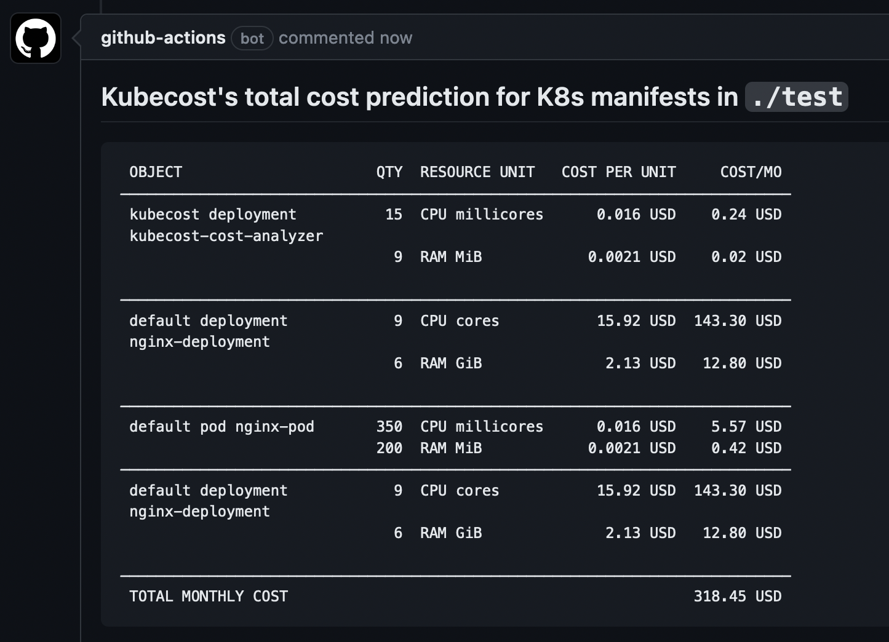

# Kubernetes Cost Prediction Action

Predict the cost of Kubernetes resource specs in CI! Make cost decisions before
merging changes.

This is a GitHub Action, powered by Kubecost, to make cost predictions for K8s
workloads before they are applied to your cluster. It _does not_ require you to
have Kubecost installed, but will have highly-accurate cost and usage
information for your environment if you do.

## Usage

Below is an example Action workflow written with this Action. And here's a
screenshot of what it would look like on your PR:



``` yaml
name: Predict K8s spec cost
on: [pull_request]

jobs:
  predict-cost:
    runs-on: ubuntu-latest
    steps:
      # Check out the current repo to ./repo
      - uses: actions/checkout@v2
        with:
          path: ./repo
          
      # If using the API support, you need to make sure the Action runner has
      # network access to your instance of Kubecost. This is infra dependent,
      # but this workflow includes an example that assumes the runner has
      # kubectl set up with access to your cluster.
      # 
      # - name: Forward the kubecost service
      #   run: |
      #     kubectl port-forward --namespace kubecost service/kubecost-cost-analyzer 9090 &
      #     sleep 5
      
      # If you use Helm, you should template the chart and then run the Predict
      # Action targeting the result. Here's an example of how to do that.
      # 
      # - name: Install helm
      #   run: |
      #     curl https://raw.githubusercontent.com/helm/helm/master/scripts/get-helm-3 | bash
      # 
      # - name: Helm template
      #   run: |
      #     helm template RELEASENAME ./repo >> ./templated.yaml

      - name: Run prediction
        id: prediction
        uses: kubecost/cost-prediction-action@v0
        with:
          log_level: "info"
          # Set this to the path containing your YAML specs. It can be a single
          # YAML file or a directory. The Action will recursively search if this
          # is a directory and process all .yaml/.yml files it finds.
          # 
          # If you use Helm, you probably want to run "helm template", output
          # to a path like ./templated.yaml, and set "path: ./templated.yaml".
          path: ./repo
          # Set this to either:
          # - localhost:9090/model if port forwarding OR
          # - The URL of your Kubecost instance if the runner has direct network
          #   access, e.g. "https://kubecost.example.com:9090/model"
          #
          # If unset, the Action will use Kubecost's default pricing to make a
          # prediction and it will be unable to make
          #
          # kubecost_api_path: "http://localhost:9090/model"

      # Write/update a comment with the prediction results.
      - name: Update PR with prediction results
        uses: edumserrano/find-create-or-update-comment@v1
        with:
          issue-number: ${{ github.event.pull_request.number }}
          body-includes: '<!-- kubecost-prediction-results -->'
          comment-author: 'github-actions[bot]'
          edit-mode: replace
          body: |
            <!-- kubecost-prediction-results -->
            
            ## Kubecost's cost prediction

            \```
            ${{ steps.prediction.outputs.PREDICTION_TABLE }}
            \```

      # Alternatively, you can just output the prediction in the Action log.
      # - name: output raw yaml prediction
      #   run: |
      #     echo "${{ steps.prediction.outputs.PREDICTION_TABLE }}"
```

## Limitations

The Action currently only supports predicting `.yml`/`.yaml` specs. If you have
specs in other formats, you will have to put them into YAML before running
prediction logic. E.g. for Helm, use `helm template`.

The Action does not yet support prediction on only changed files.

## Development

Source code for the container is mostly closed. Kubecost engineers, visit
`cmd/costpredictionaction` in KCM for more information about development, testing, and releasing.
